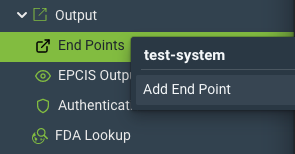
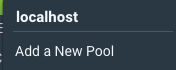
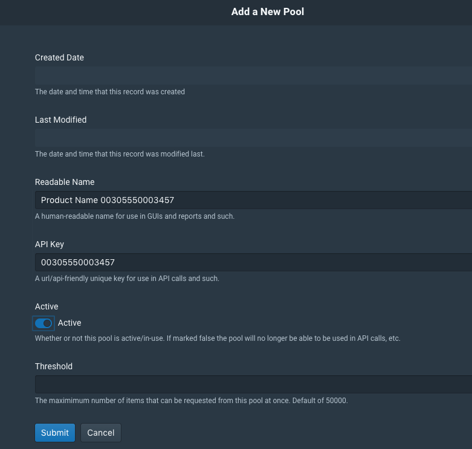
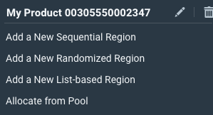
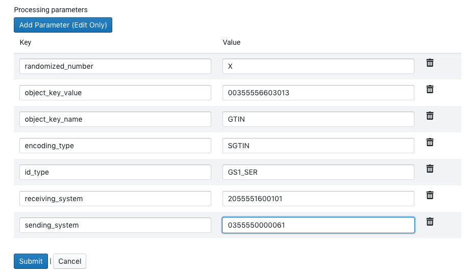
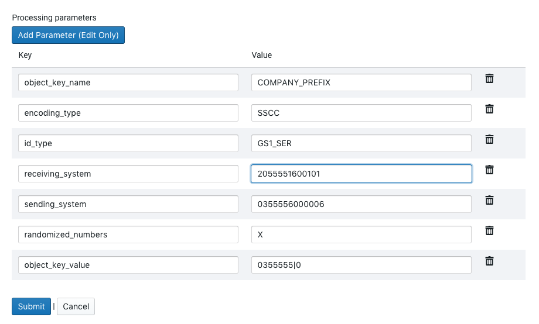

Configuration
=============

To configure QU4RTET to support a packaging line in "rfXcel" mode, a few
rules and number pool configurations need to be made that are outside of
the normal operation of QU4RTET out of the box.  This tutorial will show
you how to set up a QU4RTET system to fetch numbers from another level-4
(tracelink or rfXcel), how to handle lot-batch events and how to filter
shipping or supply chain events in order to forward on data to another system.

SerialBox Number Pool Config
============================

Configure an Endpoint
---------------------

For q4 to retrieve numbers from another system, it must have the URL to that
system.  This is configured in q4 UI under the *Output/End Points* menu.
Right click on the *End Points* menu and select *Add End Point*.

On the following screen, you will enter in the URL for either a TraceLink
or rfXcel endpoint to retrieve numbers.  (Additional endpoints can be supported
but are outside of the scope of this document right now).

TraceLink Endpoint URLS
+++++++++++++++++++++++

TraceLink can only have two endpoints since it's system is a shared,
multi-tenant system.  They are as follows:

TraceLink iTest Number Requests
    `https://itestapi.tracelink.com:443/soap/snx/snrequest`

TraceLink Prod Number Requests
    `https://api.tracelink.com:443/soap/snx/snrequest`

Each can be entered into q4 using the titles and URLs above:

.. image:: ./images/tl-prod-endpoint.png

rfXcel Endpoint URLS
++++++++++++++++++++

Each rfXcel customer will have a different server and, thus different URLs.
Having said that, each will have the following structure (in general):

`https://[CUSTOMER SYSTEM NAME].track-n-trace.net/rfxcelwss/services/ISerializationServiceSoapHttpPort`

Once you have the customer system name, you can then configure the End Point
the same way you would as with a TraceLink system.  The name of the End Point
can be anything you'd like but should be representative of the
customer and the system.  For example, ** Acme rfXcel Production Number Request **, etc.

Configure Authentication
------------------------

*Note: Authentication credentials (user names and passwords) will be provided
to you (typically) by an outside-party, customer or vendor.*

Next you will need to configure *Authentication* in q4 in order to tell these
systems we'll be requesting numbers from who we are.  In the q4 UI, right
click on *Output/Authentication* and click *Add Authentication Info*.  On
the following screen enter in the following:

* Username: [the user name you were provided]
* Password: [the password for this user]
* Type: Basic
* Description: Acme Production Number Credentials (for example)

There is no need to provide a *Private Key* or *Public Key* value.

Make sure to save your changes.

Set Up a Number Pool
--------------------

In q4 UI, right click on *Number Pools* and select Add a New Pool

In the add pool screen, add the following values as a best practice:

* Readable Name: This should be the product name and it's GTIN or, if a
  SSCC, the company name and the **company prefix with the SSCC extension
  digit appended to the beginning**.
* API Key: This should be either the SSCC or GTIN
* Active: Set this switch to be on.
* Threshold (no need to modify this).

See a "GTIN" example below.

Create a List Based Region
++++++++++++++++++++++++++

Once you create your number pool, you see it in the navigation tree on the
left of the UI.  Right click on it and select *Add a New List-based Region*.

On the next screen, add the following values:

* Readable Name:  Make this the same value as your pool readable name.
* Machine Name:  Make this the same value as your pool machine name.
* Active: True/On
* Order: 1
* Last Number Line: **LEAVE THIS BLANK**
* Processing Class Path: **LEAVE THIS BLANK**
* End Point: select the *TraceLink iTest Number Request* or the *TraceLink Prod
  Number Request* endpoint depending on the type of connection you are configuring.
* Processing Rule: Select *Tracelink Number Request*.  This should be auto-configured
  in your system via the quartet_tracelink module.  If you do not see this,
  log into the system and execute `python manage.py setup_tracelink` at the
  command line in `/srv/qu4rtet` or call your QU4RTET technical contact and
  relay this information.
* Authentication Info: select the authentication info you configured above in
  the *Configure Authentication* step of this document.
* Message Template: Copy and paste in the XML template example below.
* Processing Parameters:  See the processing paramters notes below.

.. code-block:: xml

    <soapenv:Envelope xmlns:soapenv="http://schemas.xmlsoap.org/soap/envelope/" xmlns:urn="urn:tracelink:soap">
       <soapenv:Header/>
       <soapenv:Body>
          <urn:serialNumbersRequest>
             <SendingSystem>{{ sending_system }}</SendingSystem>
             <ReceivingSystem>{{ receiving_system }}</ReceivingSystem>
             <IdType>{{ id_type }}</IdType>
             <EncodingType>{{ encoding_type }}</EncodingType>
             <Size>{{ allocate.size }}</Size>
             <ObjectKey>
                <Name>{{ object_key_name }}</Name>
                <Value>{{ object_key_value }}</Value>
             </ObjectKey>
             <RequestRandomizedNumber>{{ randomized_number }}</RequestRandomizedNumber>
          </urn:serialNumbersRequest>
       </soapenv:Body>
    </soapenv:Envelope>

Set the Processing Parameters
+++++++++++++++++++++++++++++

The following parameters must be created (see examples below):

* randomized_number: set the value to X if this is to be a random number request.
* object_key_value: set this value to the GTIN or company prefix with the
  exension digit if and SSCC of the range you are requesting from tracelink.
  For example, if a GTIN you might enter 12345678901234 or if an SSCC you'd
  enter in 0355555|0 where 0355555 is the company prefix and 0 is the extension
  digit of the SSCC you're requesting numbers for.  See example images below.
* object_key_name: set to either COMPANY_PREFIX or GTIN
* encoding_type: SGTIN or GS1_SER if you are requesting an SSCC.
* sending_system: The GLN-13 of the system that is sending the message.  This
  will correspond to a partner defined in the TraceLink system.  This value
  will be supplied and verified by tracelink / a tracelink customer but will
  typically be your GLN-13.
* receiving_system: The GLN-13 of the tracelink receiving partner.  This value
  will be supplied to you by a tracelink customer but will typically be the
  receiving party's GLN-13.

Example SGTIN Processing Parameters
***********************************

Example SSCC Processing Parameters
**********************************

