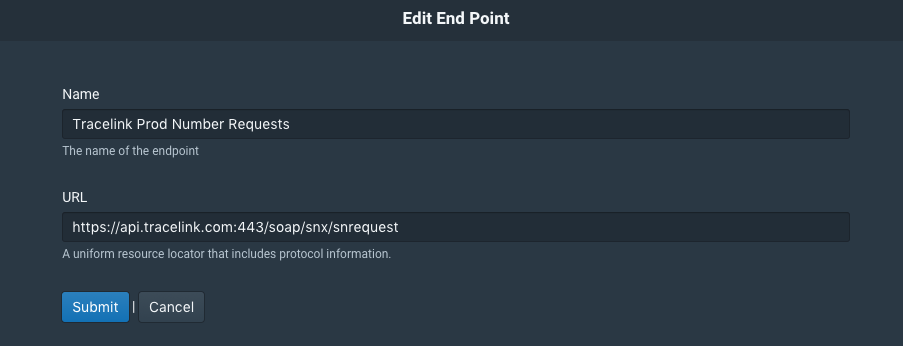

External Number Pool Configuration
==================================

To configure QU4RTET to support a packaging line in "rfXcel" mode, a few
rules and number pool configurations need to be made that are outside of
the normal operation of QU4RTET out of the box.  This tutorial will show
you how to set up a QU4RTET system to fetch numbers from another level-4
(tracelink or rfXcel), how to handle lot-batch events and how to filter
shipping or supply chain events in order to forward on data to another system.

The basic flow for external number pools is as follows.

1. A system asks q4 for numbers.
2. q4 looks to see if it has any numbers available, if so it will give them
   to the requesting system.
3. If q4 does not have any numbers, it will attempt to ask an external system
   for more by:
    a. Rendering a request template
    b. Sending the rendered data from the template to an *Endpoint* associated with a number region.
    c. Using an *Authentication* record to identify itself with the external sytem.
    d. Take the numbers from the external system and send them to a *Processing Rule* which
       is associated with a number region.
    e. Take the numbers returned from the processing rule and store them in a file
    f. Return some of the numbers stored in that file to the requesting system by
       sending those numbers through a *Response Rule* associated with a number pool.

To achieve the above, q4 must have:

1. Endpoints defined that point to where numbers will come from (urls, basically).
2. Authentication data (user-names and passwords to use so q4 can authenticate itself).
3. Templates that q4 can use to format data into structures that other systems recognize as requests for numbers.
4. Number request *Rules* defined that use all of the above data to format and send a request.
5. Number response templates that render responses to other systems in formats they can understand.
6. Number response *Rules* defined that merge numbers and templates together into downstream responses.
7. Number *Pools* with *list-based regions* defined that specify what templates, endpoints, authentication info,
   request rules and response rules go together for each number pool.

Configure an Endpoint
---------------------

For QU4RTET to retrieve numbers from another system, it must have the URL to that
system.  This is configured in QU4RTET UI under the *Output/End Points* menu.
Right click on the *End Points* menu and select *Add End Point*.

.. image:: ./images/endpoint.png

On the following screen, you will enter in the URL for either a TraceLink
or rfXcel endpoint to retrieve numbers.  (Additional endpoints can be supported
but are outside of the scope of this document right now).

TraceLink Endpoint URLS
+++++++++++++++++++++++

TraceLink can only have two endpoints since it's system is a shared,
multi-tenant system.  They are as follows:

TraceLink iTest Number Requests
    `https://itestapi.tracelink.com:443/soap/snx/snrequest`

TraceLink Prod Number Requests
    `https://api.tracelink.com:443/soap/snx/snrequest`

Each can be entered into QU4RTET using the titles and URLs above:

rfXcel Endpoint URLS
++++++++++++++++++++

Each rfXcel customer will have a different server and, thus different URLs.
Having said that, each will have the following structure (in general):

`https://[CUSTOMER SYSTEM NAME].track-n-trace.net/rfxcelwss/services/ISerializationServiceSoapHttpPort`

Once you have the customer system name, you can then configure the End Point
the same way you would as with a TraceLink system.  The name of the End Point
can be anything you'd like but should be representative of the
customer and the system.  For example, ** Acme rfXcel Production Number Request **, etc.

Configure Authentication
------------------------

*Note: Authentication credentials (user names and passwords) will be provided
to you (typically) by an outside-party, customer or vendor.*

Next you will need to configure *Authentication* in QU4RTET in order to tell these
systems we'll be requesting numbers from who we are.  In the QU4RTET UI, right
click on *Output/Authentication* and click *Add Authentication Info*.  On
the following screen enter in the following:

* Username: [the user name you were provided]
* Password: [the password for this user]
* Type: Basic
* Description: Acme Production Number Credentials (for example)

There is no need to provide a *Private Key* or *Public Key* value.

Make sure to save your changes.

Configure Number Rage Request Templates
---------------------------------------
q4 will utilizes a templating framework to render different types of data
to be sent to systems it is requesting data from.  Here we will create a
request template for rfXcel and for Tracelink systems.  In the q4 UI under
*Message Templating/Templates* right click and select *Add Template*.

Create a Tracelink Request Template
+++++++++++++++++++++++++++++++++++

On the add template screen, add the following:

1. **Name**: Tracelink Number Request
2. **Content**: *Paste in the content below:

.. code-block:: xml

    <soapenv:Envelope xmlns:soapenv="http://schemas.xmlsoap.org/soap/envelope/" xmlns:urn="urn:tracelink:soap">
       <soapenv:Header/>
       <soapenv:Body>
          <urn:serialNumbersRequest>
             <SendingSystem>{{ sending_system }}</SendingSystem>
             <ReceivingSystem>{{ receiving_system }}</ReceivingSystem>
             <IdType>{{ id_type }}</IdType>
             <EncodingType>{{ encoding_type }}</EncodingType>
             <Size>{{ allocate.size }}</Size>
             <ObjectKey>
                <Name>{{ object_key_name }}</Name>
                <Value>{{ object_key_value }}</Value>
             </ObjectKey>
             <RequestRandomizedNumber>{{ randomized_number }}</RequestRandomizedNumber>
          </urn:serialNumbersRequest>
       </soapenv:Body>
    </soapenv:Envelope>

3. Save your changes

Create an rfXcel Request Template
+++++++++++++++++++++++++++++++++

Select *Add Template* again and on the add template screen, add the following:

1. **Name**: rfXcel Number Request
2. **Content**: *Paste in the content below:

.. code-block:: xml

    <soapenv:Envelope
    xmlns:soapenv="http://schemas.xmlsoap.org/soap/envelope/"
    xmlns:ns="http://xmlns.rfxcel.com/traceability/serializationService/3"
    xmlns:ns1="http://xmlns.rfxcel.com/traceability/3"
    xmlns:xm="http://www.w3.org/2004/11/xmlmime">
        <soapenv:Header>
            <wsa:Action xmlns:wsa="http://schemas.xmlsoap.org/ws/2004/08/addressing">http://wsop.rfxcel.com/messaging/2/getMessages</wsa:Action>
            <wsa:ReplyTo xmlns:wsa="http://schemas.xmlsoap.org/ws/2004/08/addressing">
                <wsa:Address>http://schemas.xmlsoap.org/ws/2004/08/addressing/role/anonymous</wsa:Address>
            </wsa:ReplyTo>
            <wsa:To xmlns:wsa="http://schemas.xmlsoap.org/ws/2004/08/addressing">https://rfxcel.net/services/IrfxMessagingSoapHttpPort</wsa:To>
            <wsse:Security xmlns:wsse="http://docs.oasis-open.org/wss/2004/01/oasis-200401-wss-wssecurity-secext-1.0.xsd" xmlns:wsu="http://docs.oasis-open.org/wss/2004/01/oasis-200401-wss-wssecurity-utility-1.0.xsd">
               <!--optional
                <wsu:Timestamp wsu:Id="TS-2">
                    <wsu:Created>2016-02-12T16:27:08Z</wsu:Created>
                    <wsu:Expires>2016-02-12T16:27:08Z</wsu:Expires>
                </wsu:Timestamp>-->
                <wsse:UsernameToken wsu:Id="UsernameToken-1">
                    <wsse:Username>{{authentication_info.username}}</wsse:Username>
                    <wsse:Password Type="http://docs.oasis-open.org/wss/2004/01/oasis-200401-wss-username-token-profile-1.0#PasswordText">{{authentication_info.password}}</wsse:Password>
                </wsse:UsernameToken>
            </wsse:Security>

        </soapenv:Header>
        <soapenv:Body>
            <ns:syncAllocateTraceIds contentStructVer="3.1.3" createDateTime="2016-11-08T18:56:34.112Z" requestId="{{ allocate.random_event_id}}">
                   <!-- Corporate ID -->
                <ns:orgId qlfr="ORG_DEF">{{ org_sgln }}</ns:orgId>
                <ns:eventId>{{ allocate.random_event_id}}</ns:eventId>
                <!--Product Code is GTIN-->
                <ns:itemId qlfr="{{ item_id_type }}">{{ item_value }}</ns:itemId>
                <ns:siteHierId qlfr="ORG_DEF">{{ site_hier_id}}</ns:siteHierId>
                <!-- Facility ID -->
                <ns:siteId qlfr="SGLN" type="LOCATION">{{ site_gln}}</ns:siteId>
                <ns:idTextFormat>PURE_ID_URI</ns:idTextFormat>
                <ns:separatePrefixSuffix>{{separate_prefix_suffix}}</ns:separatePrefixSuffix>
                <ns:returnDataStruct>LIST</ns:returnDataStruct>
                <ns:idCount>{{ allocate.size }}</ns:idCount>
            </ns:syncAllocateTraceIds>
        </soapenv:Body>
    </soapenv:Envelope>

3. Save your changes.

Configure Number Request Processing Rules
-----------------------------------------
QU4RTET will request numbers from other systems using rules that are assigned
to specific number pools.  So when you create a pool that is sourcing numbers
from an external system, you'll tell that pool's region(s) to utilize specific
rules to execute the sourcing requests.  At the current moment, QU4RTET supports
requesting numbers from external rfXcel and Tracelink systems.

Set up the Tracelink Number Request Rule
========================================
**Note**: The quartet_tracelink module is not a standard QU4RTET python module and
must be intalled prior to using any tracelink functionality.  To install,
see the instructions provided at:

https://gitlab.com/serial-lab/quartet_tracelink

In addition, you will need the `third-party

The tracelink rule can be set up using the management command
`python manage.py setup_tracelink` and or following the manual instructions
below.

1. Create a new Rule named Tracelink Number Response
2. Add a step with the following data:
    a. **Step**: Number Request Transport Step
    b. **Description** Requests numbers and passes the response to the next step (for parsing)
    c. **Class Path** list_based_flavorpack.steps.NumberRequestTransportStep
    d. **Execution Order** 1
    e. Add a step parameter with the following values:
        i. **name**: content-type, **value**: text/xml
3. Add a second step with the following data:
    a. **Step**: Tracelink Number Response Parser
    b. **Description**: Parses numbers returned from Tracelink and persists them to file for use in list-based number regions.
    c. **Class Path**: third_party_flavors.tracelink_number_response_step.TracelinkNumberResponseParserStep
    d. **Execution Order**: 2

Save your changes.

Set up the rfXcel Number Request Rule
=====================================
1. Create a new Rule named *rfXcel Number Request*
2. Add a step with the following data:
    a. **Step**: Number Request Transport Step
    b. **Description** Requests numbers and passes the response to the next step (for parsing)
    c. **Class Path** list_based_flavorpack.steps.NumberRequestTransportStep
    d. **Execution Order** 1
3. Add a second step with the following data:
    a. **Step**: rfXcel Number Response Parser
    b. **Description**: Parses numbers returned from rfXcel and persists them to file for use in list-based number regions.
    c. **Class Path**: third_party_flavors.rfxcel_number_response_step.RFXCELNumberResponseParserStep
    d. **Execution Order**: 2

Save your changes.

Setting Up Number Pools and Regions
===================================

In QU4RTET UI, right click on *Number Pools* and select Add a New Pool

In the add pool screen, add the following values as a best practice:

* Readable Name: This should be the product name and it's GTIN or, if a
  SSCC, the company name and the **company prefix with the SSCC extension
  digit appended to the beginning**.
* API Key: This should be either the SSCC or GTIN
* Active: Set this switch to be on.
* Threshold (no need to modify this).

See a "GTIN" example below.

.. image:: ./images/new-pool.png

How to Create a Tracelink List Based Region
+++++++++++++++++++++++++++++++++++++++++++

Once you create your number pool, you see it in the navigation tree on the
left of the UI.  Right click on it and select *Add a New List-based Region*.

.. image:: ./images/new-region.png

On the next screen, add the following values:

* Readable Name:  Make this the same value as your pool readable name.
* Machine Name:  Make this the same value as your pool machine name.
* Active: True/On
* Order: 1
* Last Number Line: **LEAVE THIS BLANK**
* Processing Class Path: **LEAVE THIS BLANK**
* End Point: select the *TraceLink iTest Number Request* or the *TraceLink Prod
  Number Request* endpoint depending on the type of connection you are configuring.
* Processing Rule: Select *Tracelink Number Request*.  This should be auto-configured
  in your system via the quartet_tracelink module.  If you do not see this,
  log into the system and execute `python manage.py setup_tracelink` at the
  command line in `/srv/qu4rtet` or call your QU4RTET technical contact and
  relay this information.  If none of those options are available, see the
  *Number Request Processing Rules* section at the bottom of this document.
* Authentication Info: select the authentication info you configured above in
  the *Configure Authentication* step of this document.
* Message Template: Select the Tracelink Number Request template you created
  above.
* Processing Parameters:  See the processing paramters notes below.

Depending on which you are creating, skip to the appropriate section below.

Tracelink Processing Parameters
~~~~~~~~~~~~~~~~~~~~~~~~~~~~~~~

The following parameters must be created (see examples below):

* randomized_number: set the value to X if this is to be a random number request.
* object_key_value: set this value to the GTIN or company prefix with the
  exension digit if and SSCC of the range you are requesting from tracelink.
  For example, if a GTIN you might enter 12345678901234 or if an SSCC you'd
  enter in 0355555|0 where 0355555 is the company prefix and 0 is the extension
  digit of the SSCC you're requesting numbers for.  See example images below.
* object_key_name: set to either COMPANY_PREFIX or GTIN
* encoding_type: SGTIN or GS1_SER if you are requesting an SSCC.
* sending_system: The GLN-13 of the system that is sending the message.  This
  will correspond to a partner defined in the TraceLink system.  This value
  will be supplied and verified by tracelink / a tracelink customer but will
  typically be your GLN-13.
* receiving_system: The GLN-13 of the tracelink receiving partner.  This value
  will be supplied to you by a tracelink customer but will typically be the
  receiving party's GLN-13.

How to Create a rfXcel List Based Region
++++++++++++++++++++++++++++++++++++++++
Once you create your number pool, you see it in the navigation tree on the
left of the UI.  Right click on it and select *Add a New List-based Region*.

.. image:: ./images/new-region.png

On the next screen, add the following values:

* Readable Name:  Make this the same value as your pool readable name.
* Machine Name:  Make this the same value as your pool machine name.
* Active: True/On
* Order: 1
* Last Number Line: **LEAVE THIS BLANK**
* Processing Class Path: **LEAVE THIS BLANK**
* End Point: select the *TraceLink iTest Number Request* or the *TraceLink Prod
  Number Request* endpoint depending on the type of connection you are configuring.
* Processing Rule: Select *Tracelink Number Request*.  This should be auto-configured
  in your system via the quartet_tracelink module.  If you do not see this,
  log into the system and execute `python manage.py setup_tracelink` at the
  command line in `/srv/qu4rtet` or call your QU4RTET technical contact and
  relay this information.  If none of those options are available, see the
  *Number Request Processing Rules* section at the bottom of this document.
* Authentication Info: select the authentication info you configured above in
  the *Configure Authentication* step of this document.
* Message Template: Select the Tracelink Number Request template you created
  above.
* Processing Parameters:  See the processing paramters notes below.

Example SGTIN Processing Parameters
~~~~~~~~~~~~~~~~~~~~~~~~~~~~~~~~~~~

.. image:: ./images/example-params-gtin.png

Example SSCC Processing Parameters
~~~~~~~~~~~~~~~~~~~~~~~~~~~~~~~~~~

.. image:: ./images/sscc-params.png

Create a Response Rule for the Number Pool
++++++++++++++++++++++++++++++++++++++++++
Any number pool configured as part of this exercise must appear to the
calling line/antares/pacakging system as an rfXcel system.  The response
rules that are associated with pools handle this function by turning a
standard q4 response into what looks

rfXcel Message Template
#######################

SSCC Notes
##########
The anatares system expects the serial number field to have the extension
digit prepended to the beginning of the serial numbers.

    quartet_4nt4r3s.steps.AntaresBarcodeConversionStep
    extension_prepended_serial_number_field

Assign the Response Rule to the Number Pool
+++++++++++++++++++++++++++++++++++++++++

